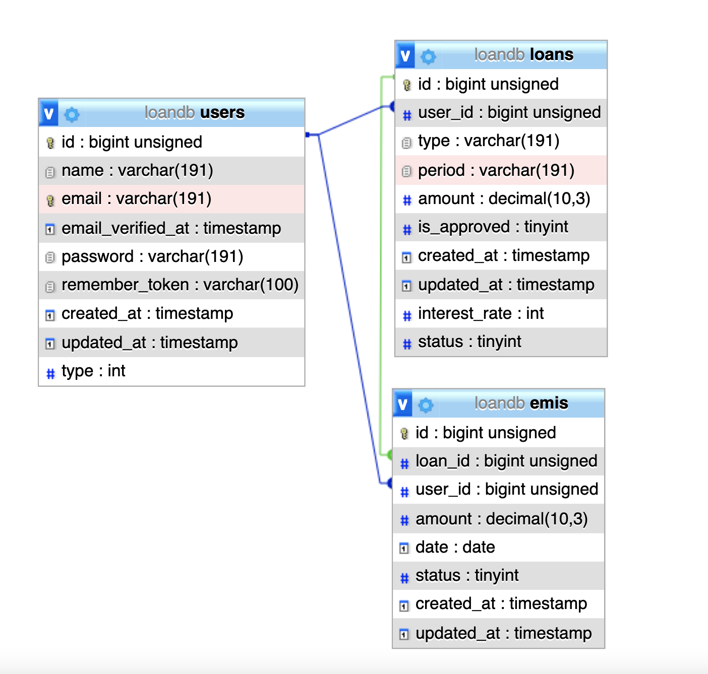

# Loan App

For this Mini-Aspire Loan App I using PHP7.4, MySQL, Laravel 6

## Postman Collection
https://www.getpostman.com/collections/b7c9a3766e1c0c3258bf

## Install Instructions 

- git clone https://github.com/hm-harshit/loanApp.git; cd loanApp;
- composer update
- php artisan migrate
- php artisan passport:install
- php artisan serve

## Database Stractures
For user authentication I am usign Laravel Passport.

